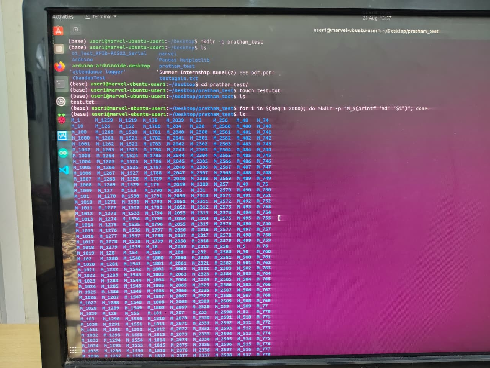
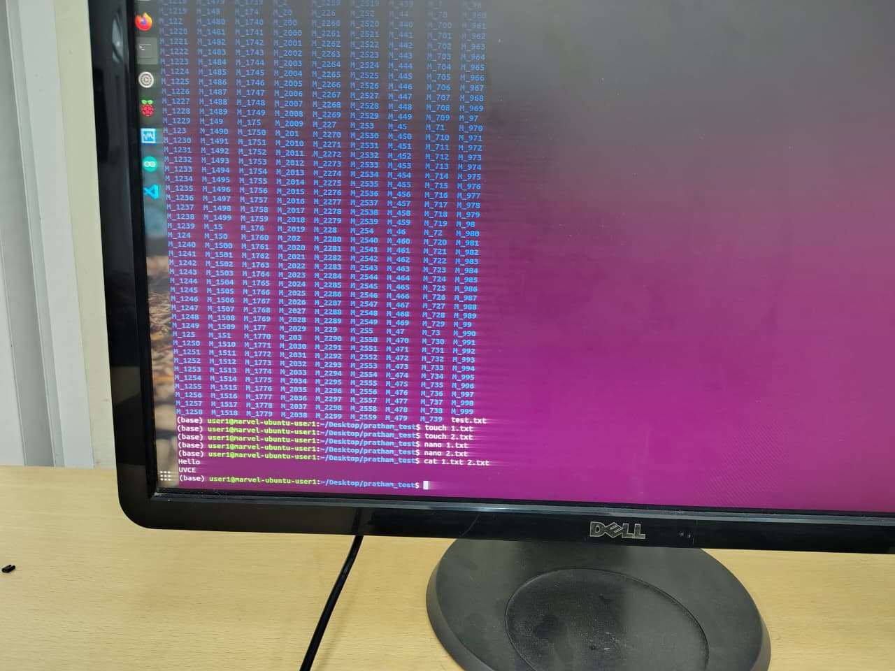

# README

This document describes the steps to complete basic Linux command-line tasks.



---

## Steps

### 1. Create a folder named `test`

```bash
mkdir -p test
```

### 2. Navigate into the `test` folder

```bash
cd test
```

### 3. Create a blank file without using any editor

```bash
touch test.txt
```

### 4. List the files in the folder

```bash
ls
```

### 5. Create 2600 folders named `M_1`, `M_2`, … `M_2600`

```bash
for i in $(seq 1 2600); do
    mkdir -p "M_${i}"
done
```

### 6. Concatenate two text files and display the result in the terminal

```bash
cat 1.txt 2.txt
```

